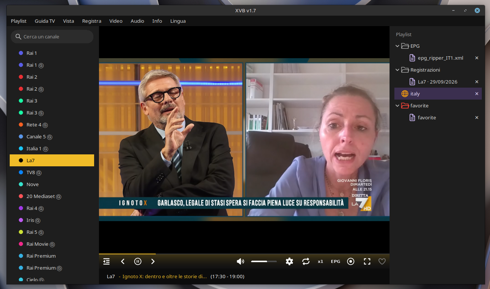

# XVB

Lettore IPTV per Linux, leggero, fatto in Python su mpv: liste `.m3u`,
guida TV XMLTV, preferiti, registrazione, quattro lingue.



## Installazione (Debian, Ubuntu, Linux Mint)

Scarica il `.deb` dall'ultima [release](../../releases/latest) e:

```
sudo apt install ./xvb_1.0_all.deb
```

Tira dentro da solo le dipendenze (`python3-tk`, `python3-pil`,
`python3-mpv`, `libmpv`) e mette XVB nel menu, sotto Audio e video, e
come comando `xvb`.

Poi metti le tue liste in `~/.local/share/xvb/playlists/` (dall'app:
Playlists → Open folder la apre nel file manager). Al primo avvio la
cartella la crea lei.

### Senza pacchetto

```
sudo apt install -y libmpv2 python3-tk python3-pil python3-pil.imagetk python3-mpv
git clone https://github.com/JonaDev2026/xvb.git ~/xvb
python3 ~/xvb/xvb.py
```

Così le liste vanno in `~/xvb/playlists/`. Se `libmpv2` non c'è sulla
tua versione usa `libmpv1`; se manca `python3-mpv`, `pip install
python-mpv --break-system-packages`.

### Fare il pacchetto

Dalla cartella del repo: `sh fai-deb.sh` produce `xvb_<versione>_all.deb`
con la versione scritta in `xvb.py` (`VERSIONE = "1.0"`): per una release
nuova si alza quel numero, si rifà il pacchetto, e il tag della release
deve essere `v` + lo stesso numero (es. `v1.1`), perché è quello che
l'app confronta per l'avviso di aggiornamento.

## Le liste

Tutto quello che sta in `playlists/` viene caricato all'avvio, con
qualunque nome, con o senza estensione: basta che dentro sia una lista
m3u. Una sottocartella è una categoria: a destra compare come cartella
colorata, si apre con un clic e mostra le liste che ha dentro.

```
playlists/
    italia.m3u
    country/
        uk.m3u
        francia
    favorite/
        favorite.m3u      <- i preferiti, li fa l'app (cartella rossa)
```

Una lista da internet si aggiunge con Playlists → Add URL, col nome che
scegli: resta un url, la copia sta in `~/.cache/xvb/liste/` e si
riscarica quando la apri se ha più di sei ore (Playlists → Reload la
riscarica subito); si toglie con Playlists → Remove <nome> o con la ✕ sulla sua riga. La ✕
c'è su ogni riga della barra a destra (liste, guide, registrazioni):
chiede conferma, e per le liste su disco e le registrazioni cancella
davvero i file. Accanto a ogni lista c'è `icone/default.png`; i canali hanno
ognuno un pallino colorato stile etichette del Mac, sempre lo stesso per
lo stesso nome.

## Come si usa

| Cosa | Come |
|---|---|
| Cambiare canale | doppio clic nell'elenco, le frecce ai lati di play, ← → sulla tastiera; il bottone switch torna al canale di prima |
| Cercare un canale | la casella in alto a sinistra |
| Pausa / riprendi | il bottone, oppure spazio |
| Volume | il cursore, la rotella sopra al cursore, oppure ↑ ↓; muto col bottone o M |
| Qualità | l'ingranaggio: parte dalla migliore che il canale offre e cambia solo se lo scegli tu |
| Video | menu Video: velocità (anche col bottone x1 nella barra, che cicla x1 → x1.25 → x1.5 → x2 → x0.5 → x0.75), proporzioni (Auto, 16:9, 4:3, 21:9) e riempi schermo, deinterlaccia, luminosità/contrasto/saturazione, istantanea in `~/Pictures/xvb/`, sempre in primo piano |
| Audio | menu Audio: traccia audio e sottotitoli del flusso (quando ne ha più d'una), volume extra +50%, normalizzazione del volume, ritardo audio |
| Ritardo audio | `+` ritarda l'audio di 100 ms (audio in anticipo sul video), `-` lo anticipa; anche dal menu Audio. Resta salvato per quel canale |
| Preferiti | il cuore mette o toglie il canale in onda dai preferiti |
| Registrare | il bottone rec registra il canale in onda in `~/Videos/xvb/` così com'è, senza ricodificare, col nome del programma (dalla guida) e data; ripremi per fermare, cambiando canale si ferma. Ogni canale ha la sua sottocartella (`~/Videos/xvb/Rai 1/...`). A destra, sotto "Recordings", una voce per canale e giorno ("Rai 1 · 29/09/2026"): cliccandola, a sinistra compaiono i programmi registrati quel giorno con l'ora, doppio clic e parte nel lettore; per tornare ai canali scegli una playlist. Record → Schedule... imposta inizio e fine: all'ora giusta l'app apre il canale e registra (deve restare aperta) |
| Guida TV | TV guide → Add URL: l'url o il file di una guida XMLTV, anche `.gz`; se ne possono aggiungere più d'una (una per paese) e si uniscono; ognuna ha la sua voce "Remove …" e la sua riga sotto EPG. Sotto il video compaiono il programma in onda e l'orario, la riga sopra i comandi è il tempo che manca alla fine. I canali si trovano col `tvg-id` della lista, o per nome |
| Schermo intero | il bottone, F11 o View → Fullscreen; Esc per uscire |
| Barre laterali | il primo bottone a sinistra le toglie e le rimette, in finestra e a schermo intero; con le barre chiuse comandi e mouse spariscono da soli dopo tre secondi. Si allargano trascinando la striscia fra la barra e il video; la larghezza resta salvata |
| Lingua | menu Language: English, Italiano, Español, Français |
| Aggiornamenti | all'avvio controlla su GitHub se c'è una release nuova e lo scrive nella riga di stato; About → Download apre la pagina, About → About XVB… mostra la versione |

Nell'elenco la riga **viola** è il canale in onda, quella **grigia** è
la selezione. L'app si ricorda l'ultima lista, l'ultimo canale, il
volume, la guida e la lingua: alla riapertura riparte da dove eri. Se
un canale non risponde passa al prossimo da sola.

## Dove finiscono le cose

- impostazioni: `~/.config/xvb/xvb.json`
- liste e preferiti: `~/.local/share/xvb/playlists/` (da installata), o `playlists/` accanto a `xvb.py`
- registrazioni: `~/Videos/xvb/`
- guida TV scaricata: `~/.cache/xvb/epg/` (si riscarica dopo sei ore, o subito con TV guide → Reload)
- liste da url scaricate: `~/.cache/xvb/liste/`
- sfondo del lettore quando non va niente: `icone/screen.png`

## Se qualcosa non va

**Si vede ma non si sente, o è nero con l'audio** – è il flusso, non
l'app: prova un altro canale.

**Audio in anticipo sul video su un canale** – anche quello è il flusso
(le due tracce hanno basi tempo diverse): `+` finché combacia, poi resta
salvato.

**Non parte e dice `No module named mpv`** – manca `python3-mpv` (o
`pip install python-mpv --break-system-packages`).

**Non parte e dice che manca `libmpv`** – `sudo apt install libmpv2` (o
`libmpv1`).

**All'avvio scrive "missing icons"** – mancano delle png in `icone/`:
dice quali.
