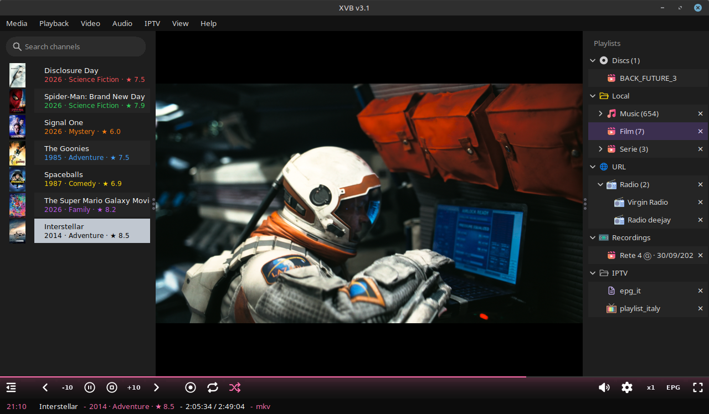

# XVB — Extended Video Broadcast

A lightweight IPTV player for Linux Mint 22+, written in Python on top of libmpv.
It reads m3u playlists (from disk or from a URL), shows an XMLTV TV
guide, records, keeps favourites, and speaks four languages. Dark
interface, drawn entirely by the app, with no GUI dependency beyond Tk.


*[Versione italiana più sotto](#xvb--extended-video-broadcast-italiano).*

## Contents

- [Install](#install)
- [Playlists](#playlists)
- [Channels](#channels)
- [TV guide](#tv-guide)
- [Recording](#recording)
- [Favourites](#favourites)
- [Video and audio](#video-and-audio)
- [The window](#the-window)
- [Menus](#menus)
- [Keyboard](#keyboard)
- [Where things go](#where-things-go)
- [Updates and versions](#updates-and-versions)
- [Troubleshooting](#troubleshooting)
- [Donate](#donate)
- [Legal & responsible use](#legal--responsible-use)

## Install

**Supported system:** Linux Mint 22+ (developed and tested there). Other
distributions will be added once they have been tested; Windows and
macOS are not supported.

### .deb package (Linux Mint 22+)

Download `xvb_<version>_all.deb` from the latest [release](../../releases/latest) and:

```
sudo apt install ./xvb_*_all.deb
```

apt pulls in the dependencies by itself (`python3-tk`, `python3-pil`,
`python3-pil.imagetk`, `python3-mpv`, `python3-mutagen`, `libmpv2` or
`libmpv1`, and `ffmpeg` as recommended) and puts
XVB in the menu under Sound & Video, and as the `xvb` command. To
update, install the new .deb over the old one; config, playlists,
favourites, guides and recordings stay where they are. To remove it:
`sudo apt remove xvb`.

When installed, the app runs as a process named `xvb` (not `python3`),
so the system monitor shows its own name and icon.

### Without the package

On Linux Mint 22+, straight from the source:

```
sudo apt install -y python3-tk python3-pil python3-pil.imagetk python3-mpv python3-mutagen ffmpeg
sudo apt install -y libmpv2 || sudo apt install -y libmpv1
```

then:

```
git clone https://github.com/JonaDev2026/xvb.git ~/xvb
python3 ~/xvb/xvb.py
```

Playlists then live in `~/xvb/playlists/`. A playlist can be passed at
start-up: `python3 xvb.py ~/list.m3u`.

### Building the package

From the repo folder (with `xvb.py`, `icone/` and `icon.png`):
`sh fai-deb.sh` produces `xvb_<version>_all.deb` with the version written
in `xvb.py` (`VERSIONE = "..."`). Only `dpkg-deb` is needed, and it's
already there.

## Playlists

They live in the right-hand bar. The app reads everything it finds in
`playlists/` (`~/.local/share/xvb/playlists/` when installed, `playlists/`
next to `xvb.py` otherwise): any name, with or without extension, as
long as the content is an m3u list. At start-up, if the folder doesn't
exist, it creates it. Playlists → Open folder opens it in the file
manager, Reload re-reads it.

**Categories.** A subfolder is a category: it shows up as a coloured,
closed folder, and a click opens it and shows the lists inside. The
name is the folder's. If the list in use is inside a folder, that folder
opens by itself at start-up.

```
playlists/
    italy.m3u
    country/
        uk.m3u
        france
    favorite/
        favorite.m3u      <- favourites, made by the app (red folder)
```

**From a URL.** Playlists → Add URL: paste the list's URL and give it a
name. It stays a URL: the copy lives in `~/.cache/xvb/liste/` and is
re-downloaded when you open it if older than six hours (Playlists →
Reload re-downloads it right away; with no network the last copy is
used). In the bar it has a globe icon. Remove it with Playlists →
Remove <name> or with the ✕.

**Colours.** Folders and globes take colours in turn, always alternating
warm and cold (orange, green, yellow, blue, amber, purple, cyan…); red
belongs to favourites only, grey to EPG and Recordings only. Next to
every list there's `icone/default.png`.

**The ✕.** Every row in the right-hand bar (lists, guides, recordings)
has a ✕ at the edge: clicking it removes that item, after a
confirmation. For lists on disk and recordings it really deletes the
files; for URL lists and guides it only removes them from the list.

**Local files.** The File menu works like a media player. File →
Open folder… adds a folder of videos or music to the right-hand bar,
with the player icon (`icone/player.png`), its name and the number of
files in it; under it, one row per subfolder that has media, each with
its own count: click the folder for everything (subfolders included,
in path order, so albums stay together), click a subfolder for just
that one. File → Open file… plays one file right away and adds it to
an "Imported media" entry, same icon, which keeps every file opened
this way. Double-click plays; when a file ends the next one in the list
starts by itself and it stops at the last. ‹ › go to the previous and
next file, the progress line follows the file and the status row shows
elapsed / total time and the format ("- mp3"). Click a playlist to get
back to the channels. The ✕ removes the folder or empties Imported
media, after confirmation: nothing is deleted from disk. The file and
folder chooser is drawn by the app, dark like the rest: ↑ or Backspace
go up, double-click enters a folder or picks a file, the path on top
can be typed.

**Titles and details.** Music shows the title from its tags
(python3-mutagen) and, under it, "Artist · Album · Year"; the year comes
from MusicBrainz when the tags don't have it. Films show the title from
TMDB and, under it, "2023 · Drama · ★ 7.8" (year, genre, rating); a film
TMDB doesn't know keeps its file name, with the year from the name if
there is one. Titles and genres come in the app's language: changing
language asks whether to download them again in the new one. Each file
has its own colour on the left, from a scale of 16 alternating warm and
cold (it repeats only after 16 files); channels keep their logo's colour.
Tags are kept in `~/.cache/xvb/tag.json`, the rest in `~/.cache/xvb/info.json`.

**Shuffle.** The shuffle button (after switch; also File → Shuffle)
mixes the list of files on the left, with the one playing on top; then
it plays top to bottom as usual, so you always see what comes next and
‹ really goes back. Off, the original order comes back. White when off,
in the channel colour when on; remembered.

**Seeking.** Click or drag on the progress line, the -10 / +10 buttons
around play, or Shift+← →: ten seconds back or forward. On live
channels it works only if mpv says the stream can be seeked (inside
its buffer or the HLS window). The pointer becomes a hand over the
line only when a file is playing.

**Resume.** A file left halfway restarts where you were (from ten
seconds in; within twenty seconds of the end it forgets and restarts
from the beginning). Positions live in the config, at most 300.

**Covers and posters.** With View → Logos (the default) each file has its
picture in a column on the left, as tall as its row: music shows its
embedded cover, or `cover.jpg` / `folder.jpg` from the album folder;
videos an image with the same name or `poster.jpg`, otherwise a frame
taken at 30 s with ffmpeg; with nothing at all, the app icon. Made in the
background, kept in `~/.cache/xvb/anteprime/`.

**Downloading them.** At start-up, in the background, the app looks for
what's missing in the added folders and Imported media and downloads it:
film posters from [TMDB](https://www.themoviedb.org) (by the name of the
file or folder, "Title (Year)" or "Title.Year.1080p"), saved next to the
film with its name; album covers from MusicBrainz / Cover Art Archive (by
the artist and album in the tags), saved as `cover.jpg` in the folder.
It never overwrites an image already there. Files already searched with
no result (private ones) aren't searched again; File → Download posters
and covers tries everything again. No key to set up.

The formats are mpv's, that is ffmpeg's:

- Video: mkv, mp4, m4v, avi, mov, webm, ts, m2ts, mpg, mpeg, wmv, flv, ogv.
- Audio: mp3, flac, ogg, opus, m4a, aac, wav, wma, ape.
- Subtitles: srt, ass, ssa, sub, vtt next to the video with the same
  name are picked up by themselves; embedded ones from Audio → Subtitles.

Playlists (m3u) with local paths in them play the same way.



**Memory.** The app remembers the last playlist and the last channel and
restarts from there (if the channel is in another list, it opens that
one). It also remembers volume, language, guides, sidebar widths and
all the video/audio settings.

## Channels

In the left-hand bar, with the search box on top (it filters as you
type; Esc clears it). Double-click or Enter to watch a channel, the
‹ › arrows in the control bar or ← → on the keyboard to go to the
previous or next one, the switch button to go back to the previous
channel (and, pressed again, back to this one).

**The rows.** Two lines each: the channel name (15 px) and, under it,
the programme on air from the guide (12 px), in the channel's colour;
it updates by itself every minute. Rows alternate two shades of dark,
3 px apart. What marks the channel on the left is chosen in View:
Logos (default: the list's `tvg-logo` in a column on the left, outside
the rows and as tall as them, a dot where there's none), Dots
(macOS-tag style) or Border (a 3 px strip in the colour).

**The colour.** If the list has logos (`tvg-logo`), the colour comes
from the logo: the app downloads it to `~/.cache/xvb/loghi/`, discards
whites, blacks and greys, takes the dominant hue and brings it to a
brightness that shows on dark (blues a little lighter). It's computed
once and kept in `~/.cache/xvb/colori.json`; Playlists → Reload redoes
it. Without a logo the colour depends on the name, so it's always the
same.

**The channel on air.** Its row takes the colour as background, with
text in white or black depending on how light it is. The same colour
goes on the time and the programme title in the row below, on the
progress line and in the gradient behind the controls.

**Quality.** If the channel offers several qualities (HLS master), the
app starts from the best and stays there: you change it only from the
gear menu, which lists the qualities with name and resolution (360p,
720p HD, 1080p Full HD, 4K…) and a tick on the one in use. Audio-only
variants are skipped. To have mpv read video and audio together (in
streams with the audio in a separate group) the app writes a local
master playlist with just the chosen variant: `~/.cache/xvb/variante.m3u8`.

**Dead channels.** If a channel errors out or doesn't start within 30
seconds, it skips to the next one; after ten in a row it stops and
says so.

## TV guide

TV guide → Add URL: the URL (or path) of an XMLTV guide, `.xml` or `.gz`
(detected from the content). You can add more than one, e.g. one per
country: they merge, and for a channel the first one that has it
wins. Each one shows under the EPG folder with the file name (the one
inside the archive, if any) and has its own Remove entry in the menu
and the ✕.

The guide is downloaded to `~/.cache/xvb/epg/` and reused for six hours,
then fetched again at start-up; TV guide → Reload re-downloads it
right away. In memory it keeps only programmes from an hour ago
onwards, so even guides of tens of MB are light.

Channels are matched by the list's `tvg-id`; failing that, by name,
stripped to the bone (lower case, no spaces or punctuation, no
HD/FHD/4K suffix), so "NEWS 24 HD" and "News24" match. Times carry the
guide's own time zone and are shown in the PC's local time, so they
are right wherever you are.

**In the row below the video:** the current time, the channel, the
title of the programme on air and its slot, "20:05  News 24 - Evening
News (20:00 - 20:30)"; time and title take the channel's colour. The
line above the controls is the progress: how much of the programme
has elapsed; it fills from the left and switches by itself to the next
programme. If the channel isn't in the guide it says so; with no guide
the progress stays empty.

**The grid.** TV guide → Programme guide, or the EPG button in the bar: a
window with one row per channel of the open list, hours on top,
programmes as blocks, the on-air block shaded in the channel's colour,
the lilac line is now. From half an hour ago to six hours ahead;
wheel for rows, Shift+wheel for time; hours and names stay put while
you scroll. Click a name or a block to open the channel; Esc closes;
it redraws every 30 seconds.

## Recording

The rec button records the channel on air as-is, without re-encoding
(mpv's `stream-record`): no extra CPU, audio and video together, in
the quality you're watching. The file goes to
`~/Videos/xvb/<channel>/<Programme> - <date> <time>.mkv`, with the title
taken from the guide (or the channel name if missing). Press again to
stop; changing channel stops it. While recording, a red dot pulses at
the end of the status row with "REC" and the running time.

**Scheduling.** Record → Schedule…: start and end time (HH:MM) for the
channel on air; if the time has passed it means tomorrow. At the right
time the app opens the channel, if you're not on it, and records until
the end ("REC until 21:30"). The app must stay open. Record → Cancel
schedule cancels it.

**Watching back.** In the right-hand bar, under Recordings, one entry per
channel and day ("News 24 · 29/09/2026"), most recent first. Clicking
it, the left-hand bar shows the programmes recorded that day with the
time, "20:00 Evening News": double-click and it plays in the player, ‹ › go to
the previous and next one, the progress shows where you are in the
file. To get back to the channels click a playlist. The ✕ on the entry
deletes all that day's recordings from disk, after confirmation.
Record → Open recordings folder opens the folder.

## Favourites

The heart in the control bar adds or removes what's on air from the
favourites. They are real lists in the red `favorite` folder, one per
kind: `iptv.m3u` for channels, `music.m3u` for audio files, `video.m3u`
for videos; each appears with the first favourite and goes away when
empty, the folder when all three are. A channel counts as a favourite
even if it comes from another list with another address, as long as it
has the same name. (An old `favorite.m3u` is renamed to `iptv.m3u`.)

## Video and audio

**Video** menu:
- Speed: x0.5, x0.75, x1, x1.25, x1.5, x2. Also with the x1 button in the
  bar, which cycles x1 → x1.25 → x1.5 → x2 → x0.5 → x0.75. On live streams
  above x1 the buffer runs out; it mostly makes sense on recordings.
- Aspect: Auto, 16:9, 4:3, 21:9; Fill screen crops the bars away.
- Deinterlace, for SD channels that flicker.
- Brightness, contrast, saturation in steps of 10, and Reset picture.
- Screenshot: a frame saved to `~/Pictures/xvb/`.
- Always on top: the window stays above the others.

**Audio** menu:
- Audio track and subtitles, when the stream has them (they show up
  only then), with a tick on the one in use.
- Volume boost +50%, for quiet channels.
- Normalize loudness: evens the volume out (adverts, films).
- Audio delay: +100 ms / −100 ms / Reset, also with the `+` and `-` keys.
  For channels whose audio runs ahead of the video (the two tracks
  have different time bases; no player can fix that by itself): adjust
  until it lines up and the value is saved for that channel, so next
  time it starts right.

All of these are kept in the config, except the speed, which restarts at x1.

## The window

- **Top bar** with the menus: File, Playlists, TV guide, View, Record, Video,
  Audio, About, Language. Menus, dialogs and confirmations are drawn
  by the app, dark like the rest.
- **Sidebars**: the first button on the left of the control bar hides
  and shows both of them (the icon flips when they're closed), in a
  window and in full screen; View → Hide/Show handles them one at a
  time. They resize by dragging the strip between the bar and the
  video (from 140 px to 60% of the window); the width is saved.
- **Controls**: [sidebars] [‹ -10 pause +10 › rec switch shuffle] …
  [speaker, gear] [x1, EPG] [full screen, heart]. The volume works like YouTube's: the
  bar is hidden and slides out to the left of the speaker when the mouse
  is over it, then folds back; the speaker icon follows the level (off,
  low, medium, high, muted). Behind the controls there's a gradient in the
  channel's colour, starting from the progress line and fading
  downwards; the icons sit on it with no background.
- **Full screen**: the button, F11 or View → Fullscreen; Esc to leave.
  With the sidebars closed, controls and mouse disappear after three
  idle seconds and come back when the mouse moves — in a window too.
  With the sidebars open they stay.
- **Background**: when nothing is playing the player shows `icone/screen.png`.
- **Notices**: a purple panel above the controls, with "xvb" on the
  left, for important messages (e.g. a new version); it goes away by
  itself or with a click.
- **Language**: Language menu, English / Italiano / Español / Français;
  applied at once and saved. The app's texts are English by default,
  translations live in a dictionary at the top of `xvb.py`.
- **About**: About → About XVB… shows icon, version, author, licence and
  the link to the repo.

## Menus

| Menu | Entries |
|---|---|
| File | Open file…, Open folder…, Download posters and covers, Shuffle |
| Playlists | Add URL, Open folder, Reload, Remove <URL list> |
| TV guide | Programme guide, Add URL, Reload, Remove <guide> |
| View | Fullscreen, Hide/Show channels, Hide/Show playlists, Logos / Dots / Border |
| Record | Record now / Stop recording, Schedule…, Cancel schedule, Open recordings folder |
| Video | Speed, Aspect, Fill screen, Deinterlace, Brightness/Contrast/Saturation, Reset picture, Screenshot, Always on top |
| Audio | Track, Subtitles, Volume boost, Normalize loudness, Delay +/−, Reset delay |
| About | About XVB…, Check for updates, Download <version> |
| Language | English, Italiano, Español, Français |

## Keyboard

| Key | Action |
|---|---|
| Space | pause / resume |
| ← → | previous / next channel (also PgUp PgDn) |
| Shift+← → | ten seconds back / forward in a file |
| ↑ ↓ | volume (also the wheel over the slider) |
| M | mute |
| + − | audio delay ±100 ms |
| F11 | full screen; Esc to leave |
| Esc in the search box | clears it |

With the focus in the search box keys type there; a click on the video
gives them back to the player.

## Where things go

- settings: `~/.config/xvb/xvb.json`
- playlists and favourites: `~/.local/share/xvb/playlists/` (installed), or `playlists/` next to `xvb.py`
- recordings: `~/Videos/xvb/<channel>/`
- screenshots: `~/Pictures/xvb/`
- downloaded TV guides: `~/.cache/xvb/epg/`
- downloaded URL lists: `~/.cache/xvb/liste/`
- channel logos and colours: `~/.cache/xvb/loghi/`, `~/.cache/xvb/colori.json`
- music tags and covers / video frames: `~/.cache/xvb/tag.json`, `~/.cache/xvb/anteprime/`
- the playlist of the quality in use: `~/.cache/xvb/variante.m3u8`

The whole cache can be deleted: it rebuilds itself.

## Updates and versions

At start-up, after a few seconds, the app asks GitHub for the latest
release: if it's newer it says so in the purple panel and About gets a
"Download <version>" entry that opens the release page. About → Check
for updates does it on demand.

To publish a new version: raise `VERSIONE` in `xvb.py`, rebuild the
package with `sh fai-deb.sh`, and the release tag must be `v` + the same
number (e.g. `v1.8`), because that's what the app compares.

## Troubleshooting

**Video but no sound, or black with sound** – it's the stream, not the
app: try another channel.

**Audio ahead of the video on a channel** – the stream again: Audio →
Delay +100 ms (or `+`) until it lines up, then it's saved.

**A channel isn't in the guide** – the list lacks the right `tvg-id` and
the name is too different from the guide's. You can put the `tvg-id`
by hand in the list's `#EXTINF` line.

**Won't start, says `No module named mpv`** – `python3-mpv` is missing
(or `pip install python-mpv --break-system-packages`).

**Won't start, says `libmpv` is missing** – `sudo apt install libmpv2`
(or `libmpv1`).

**Says "missing icons" at start-up** – some png files are missing from
`icone/`: it tells you which.

**The gradient or the composed icons don't show** – `python3-pil` is missing.

**High CPU** – decoding is software (`hwdec=no`; hardware acceleration
gave a black screen on some streams). On a normal PC a 1080p stream
stays under 10%.

## Donate

XVB is free and will stay free. If it's useful to you, a coffee helps:
[paypal.me/Jonathanuk](https://www.paypal.com/paypalme/Jonathanuk). There's
also a Donate entry in the About menu.

## Legal & responsible use

XVB is a neutral playback tool: it does not provide channels, credentials,
or content. Use XVB only with streams you are authorized to access. Avoid
piracy or any method to bypass copyright protections.

## Credits

This product uses the TMDB API but is not endorsed or certified by
TMDB. Album covers from MusicBrainz and the Cover Art Archive.

## Licence

MIT. © 2026 Jonathan Sanfilippo.

---


# XVB — Extended Video Broadcast (italiano)

Lettore IPTV per Linux Mint 22+, leggero, scritto in Python su libmpv. Legge le
playlist m3u (da disco o da url), mostra la guida TV XMLTV, registra,
tiene i preferiti, e parla quattro lingue. Interfaccia scura, tutta
disegnata dall'app, senza dipendenze grafiche oltre a Tk.


## Indice

- [Installazione](#installazione)
- [Le playlist](#le-playlist)
- [I canali](#i-canali)
- [La guida TV](#la-guida-tv)
- [Registrare](#registrare)
- [Preferiti](#preferiti)
- [Video e audio](#video-e-audio)
- [La finestra](#la-finestra)
- [Menu e comandi](#menu-e-comandi)
- [Tastiera](#tastiera)
- [Dove finiscono le cose](#dove-finiscono-le-cose)
- [Aggiornamenti e versioni](#aggiornamenti-e-versioni)
- [Se qualcosa non va](#se-qualcosa-non-va)
- [Donazioni](#donazioni)
- [Uso legale e responsabile](#uso-legale-e-responsabile)

## Installazione

**Sistema supportato:** Linux Mint 22+ (sviluppata e provata lì). Le altre
distribuzioni si aggiungeranno quando saranno provate; Windows e macOS
non sono supportati.

### Pacchetto .deb (Linux Mint 22+)

Scarica `xvb_<versione>_all.deb` dall'ultima [release](../../releases/latest) e:

```
sudo apt install ./xvb_*_all.deb
```

apt tira dentro da solo le dipendenze (`python3-tk`, `python3-pil`,
`python3-pil.imagetk`, `python3-mpv`, `python3-mutagen`, `libmpv2` o
`libmpv1`, e `ffmpeg` come consigliato) e mette XVB
nel menu, sotto Audio e video, e come comando `xvb`. Per aggiornare si
installa il .deb nuovo sopra al vecchio; config, playlist, preferiti,
guida e registrazioni restano dove sono. Per toglierla: `sudo apt remove xvb`.

Da installata, l'app gira come processo `xvb` (non `python3`), così nel
monitor di sistema ha nome e icona suoi.

### Senza pacchetto

Su Linux Mint 22+, direttamente dal sorgente:

```
sudo apt install -y python3-tk python3-pil python3-pil.imagetk python3-mpv python3-mutagen ffmpeg
sudo apt install -y libmpv2 || sudo apt install -y libmpv1
```

poi:

```
git clone https://github.com/JonaDev2026/xvb.git ~/xvb
python3 ~/xvb/xvb.py
```

Così le playlist vanno in `~/xvb/playlists/`. Si può passare una lista all'avvio:
`python3 xvb.py ~/lista.m3u`.

### Fare il pacchetto

Dalla cartella del repo (con `xvb.py`, `icone/` e `icon.png`):
`sh fai-deb.sh` produce `xvb_<versione>_all.deb` con la versione scritta
in `xvb.py` (`VERSIONE = "..."`). Serve solo `dpkg-deb`, che c'è già.

## Le playlist

Stanno nella barra a destra. L'app legge tutto quello che trova in
`playlists/` (`~/.local/share/xvb/playlists/` da installata, `playlists/`
accanto a `xvb.py` altrimenti): qualunque nome, con o senza estensione,
basta che dentro sia una lista m3u. All'avvio, se la cartella non c'è, la
crea. Playlists → Open folder la apre nel file manager, Reload la rilegge.

**Categorie.** Una sottocartella è una categoria: compare come cartella
colorata, chiusa, e con un clic si apre e mostra le liste che ha dentro.
Il nome è quello della cartella. Se la lista in uso sta in una cartella,
quella si apre da sola all'avvio.

```
playlists/
    italia.m3u
    country/
        uk.m3u
        francia
    favorite/
        favorite.m3u      <- i preferiti, li fa l'app (cartella rossa)
```

**Da url.** Playlists → Add URL: incolli l'url della lista e le dai un
nome. Resta un url: la copia sta in `~/.cache/xvb/liste/` e si riscarica
quando la apri se ha più di sei ore (Playlists → Reload la riscarica
subito; senza rete si usa l'ultima copia). Nella barra ha l'icona del
globo. Si toglie con Playlists → Remove <nome> o con la ✕.

**Colori.** Le cartelle e i globi prendono i colori a turno, sempre un
caldo e un freddo alternati (arancio, verde, giallo, blu, ambra, viola,
celeste…); il rosso è solo dei preferiti, il grigio solo di EPG e
Recordings. Accanto a ogni lista c'è `icone/default.png`.

**La ✕.** Ogni riga della barra a destra (liste, guide, registrazioni)
ha una ✕ sul bordo: cliccandola si toglie quella cosa, dopo una
conferma. Per le liste su disco e le registrazioni cancella davvero i
file; per liste da url e guide le toglie solo dall'elenco.

**File locali.** Il menu File lavora come un lettore multimediale.
File → Open folder… aggiunge una cartella di video o musica alla barra
di destra, con l'icona del player (`icone/player.png`), il nome e il
numero di file; sotto, una riga per ogni sottocartella che ha dei
media, ognuna col suo conteggio: clic sulla cartella per tutto
(sottocartelle comprese, in ordine di percorso, così gli album restano
insieme), clic su una sottocartella per quella sola. File → Open file…
riproduce subito un file e lo aggiunge a una voce "Imported media",
stessa icona, che tiene tutti i file aperti così. Doppio clic e parte;
a fine file parte da solo il successivo dell'elenco e all'ultimo si
ferma. ‹ › vanno al file prima e dopo, la linea di avanzamento segue
il file e la riga di stato mostra tempo passato / totale e il formato
("- mp3"). Clic su una playlist per tornare ai canali. La ✕ toglie la
cartella o svuota Imported media, dopo conferma: dal disco non si
cancella niente. La finestra per scegliere file e cartelle è disegnata
dall'app, scura come il resto: ↑ o Backspace salgono, doppio clic entra
in una cartella o prende un file, il percorso in cima si può scrivere.

**Titoli e dettagli.** La musica mostra il titolo dai tag
(python3-mutagen) e sotto "Artista · Album · Anno"; l'anno arriva da
MusicBrainz se nei tag manca. I film mostrano il titolo da TMDB e sotto
"2023 · Drama · ★ 7.8" (anno, genere, voto); un film che TMDB non conosce
tiene il nome del file, con l'anno preso dal nome se c'è. Titoli e
generi arrivano nella lingua dell'app: cambiando lingua chiede se
riscaricarli in quella nuova. Ogni file ha il suo colore a sinistra, da
una scala di 16 che alterna caldi e freddi (si ripete solo dopo 16
file); i canali tengono il colore del loro logo. I tag stanno in
`~/.cache/xvb/tag.json`, il resto in `~/.cache/xvb/info.json`.

**Shuffle.** Il tasto shuffle (dopo switch; anche File → Shuffle)
mescola l'elenco dei file a sinistra, con quello in onda in cima; poi si
va dall'alto in basso come sempre, così vedi cosa viene dopo e ‹ torna
davvero indietro. Spento, torna l'ordine originale. Bianco da spento,
del colore del canale da acceso; ricordato.

**Scorrere.** Clic o trascinamento sulla linea di avanzamento, i tasti
-10 / +10 ai lati di play, o Shift+← →: dieci secondi indietro o
avanti. Sui canali in diretta va solo se mpv dice che il flusso si può
scorrere (dentro al suo buffer o alla finestra HLS). Sulla linea il
puntatore diventa una manina solo con un file in riproduzione.

**Riprendi.** Un file lasciato a metà riparte da dove eri (dopo i primi
dieci secondi; a meno di venti secondi dalla fine dimentica e riparte
da capo). Le posizioni stanno nel config, al massimo 300.

**Copertine e poster.** Con View → Logos (il default) ogni file ha la sua
immagine in una colonna a sinistra, alta quanto la sua riga: la musica
mostra la copertina incorporata, o `cover.jpg` / `folder.jpg` della
cartella dell'album; i video un'immagine con lo stesso nome o
`poster.jpg`, se no un fotogramma preso a 30 s con ffmpeg; se non c'è
niente, l'icona dell'app. Fatte in sottofondo, tenute in
`~/.cache/xvb/anteprime/`.

**Scaricarle.** All'avvio, in sottofondo, l'app cerca quello che manca
nelle cartelle aggiunte e in Imported media e lo scarica: i poster dei
film da [TMDB](https://www.themoviedb.org) (dal nome del file o della
cartella, "Titolo (Anno)" o "Titolo.Anno.1080p"), salvati accanto al film
col suo nome; le copertine degli album da MusicBrainz / Cover Art Archive
(da artista e album dei tag), salvate come `cover.jpg` nella cartella.
Non sovrascrive mai un'immagine che c'è già. I file già cercati senza
risultato (quelli privati) non si ricercano; File → Download posters and
covers riprova tutto. Nessuna chiave da configurare.

I formati sono quelli di mpv, cioè di ffmpeg:

- Video: mkv, mp4, m4v, avi, mov, webm, ts, m2ts, mpg, mpeg, wmv, flv, ogv.
- Audio: mp3, flac, ogg, opus, m4a, aac, wav, wma, ape.
- Sottotitoli: srt, ass, ssa, sub, vtt accanto al video con lo stesso
  nome vengono presi da soli; quelli dentro il file da Audio → Subtitles.

Anche le playlist (m3u) con dentro percorsi locali vanno allo stesso modo.


**Memoria.** L'app ricorda l'ultima playlist e l'ultimo canale e alla
riapertura riparte da lì (se il canale sta in un'altra lista, apre
quella). Ricorda anche volume, lingua, guide, larghezza delle barre e
tutte le impostazioni video/audio.

## I canali

Nella barra a sinistra, con la casella di ricerca in cima (filtra mentre
scrivi; Esc la svuota). Doppio clic o Invio per vedere un canale, le
frecce ‹ › nella barra dei comandi o ← → sulla tastiera per passare al
precedente o al successivo, il bottone switch per tornare al canale di
prima (e ripremuto, di nuovo a questo).

**Le righe.** Due linee ciascuna: il nome del canale (15 px) e sotto
il programma in onda dalla guida (12 px), nel colore del canale; si
aggiorna da sola ogni minuto. Le righe alternano due tonalità di scuro,
con 3 px di stacco. Cosa marca il canale a sinistra si sceglie in View:
Logos (il default: il `tvg-logo` della lista in una colonna a sinistra,
fuori dalle righe e alta quanto loro, un pallino dove manca), Dots
(pallini stile etichette del Mac) o Border (una striscia di 3 px del
colore).

**Il colore.** Se la lista ha i loghi (`tvg-logo`), il colore viene dal
logo: l'app lo scarica in `~/.cache/xvb/loghi/`, butta bianchi, neri e
grigi, prende la tinta dominante e la porta a una luminosità che si
veda sullo scuro (i blu un po' più chiari). Il calcolo si fa una volta
e resta in `~/.cache/xvb/colori.json`; Playlists → Reload lo rifà. Senza
logo il colore dipende dal nome, quindi è sempre lo stesso.

**Il canale in onda.** La sua riga prende come sfondo il colore, con
testo bianco o nero a seconda di quanto è chiaro. Lo stesso colore va
sull'ora e sul titolo del programma nella riga sotto, sulla progress e
nella sfumatura dietro ai comandi.

**Qualità.** Se il canale offre più qualità (master HLS), l'app parte
dalla migliore e ci resta: si cambia solo dal menu dell'ingranaggio,
che elenca le qualità con nome e risoluzione (360p, 720p HD, 1080p Full
HD, 4K…) e la spunta su quella in uso. Le varianti solo audio vengono
scartate. Per far leggere a mpv video e audio insieme (nei flussi con
l'audio in un gruppo separato) l'app scrive una master playlist locale
con la sola variante scelta: `~/.cache/xvb/variante.m3u8`.

**Canali morti.** Se un canale dà errore o non parte entro 30 secondi
si passa al successivo; dopo dieci di fila si ferma e lo dice.

## La guida TV

TV guide → Add URL: l'url (o il percorso) di una guida XMLTV, `.xml` o
`.gz` (lo capisce dal contenuto). Se ne possono aggiungere più d'una, per
esempio una per paese: si uniscono, e per un canale vale la prima che
lo ha. Ognuna compare sotto la cartella EPG col nome del file (quello
dentro all'archivio, se c'è) e ha la sua voce Remove nel menu e la ✕.

La guida si scarica in `~/.cache/xvb/epg/` e si riusa per sei ore, poi si
riprende all'avvio; TV guide → Reload la riscarica subito. In memoria
tiene solo i programmi da un'ora fa in poi, così anche le guide da
decine di MB non pesano.

I canali si trovano col `tvg-id` della lista; se manca, per nome, ridotto
all'osso (minuscolo, senza spazi e punteggiatura, senza HD/FHD/4K in
coda), così "NEWS 24 HD" e "News24" combaciano. Gli orari hanno il fuso
scritto nella guida e vengono mostrati nell'ora locale del PC, quindi
sono giusti ovunque tu sia.

**Nella riga sotto il video:** l'ora, il canale, il titolo del programma
in onda e la sua fascia, "20:05  News 24 - Evening News (20:00 - 20:30)";
ora e titolo prendono il colore del canale. La riga
sopra i comandi è la progress: quanto del programma è passato, si
riempie da sinistra e cambia da sola al programma dopo. Se il canale
non è in guida lo dice; senza guida la progress resta vuota.

**La griglia.** TV guide → Programme guide, o il bottone EPG nella barra:
una finestra con una riga per canale della lista aperta, le ore in
cima, i programmi come blocchi, il blocco in onda sfumato col colore
del canale, la riga lilla è adesso. Da mezz'ora fa a sei ore avanti;
rotella per le righe, Shift+rotella per il tempo; ore e nomi restano
fermi mentre scorri. Clic su un nome o su un blocco apre il canale; Esc
chiude; si ridisegna ogni 30 secondi.

## Registrare

Il bottone rec registra il canale in onda così com'è, senza
ricodificare (`stream-record` di mpv): zero CPU in più, audio e video
insieme, nella qualità che stai guardando. Il file va in
`~/Videos/xvb/<canale>/<Programma> - <data> <ora>.mkv`, col titolo preso
dalla guida (se manca, il nome del canale). Ripremi per fermare;
cambiando canale si ferma da sola. Mentre registra, in fondo alla riga
di stato pulsa un pallino rosso con "REC" e il tempo che scorre.

**Pianificare.** Record → Schedule…: ora di inizio e di fine (HH:MM) per
il canale in onda; se l'ora è passata intende domani. All'ora giusta
l'app apre il canale, se non ci sei, e registra fino alla fine ("REC
until 21:30"). L'app deve restare aperta. Record → Cancel schedule la
annulla.

**Rivedere.** Nella barra a destra, sotto Recordings, una voce per
canale e giorno ("News 24 · 29/09/2026"), dalla più recente. Cliccandola,
a sinistra al posto dei canali compaiono i programmi registrati quel
giorno con l'ora, "20:00 Evening News": doppio clic e parte nel lettore, ‹ ›
passano al precedente e al successivo, la progress mostra a che punto
del file sei. Per tornare ai canali clicca una playlist. La ✕ sulla
voce cancella dal disco tutte le registrazioni di quel giorno, dopo
conferma. Record → Open recordings folder apre la cartella.

## Preferiti

Il cuore nella barra dei comandi mette o toglie dai preferiti quello
che è in onda. Sono liste vere nella cartella rossa `favorite`, una per
tipo: `iptv.m3u` per i canali, `music.m3u` per i file audio, `video.m3u`
per i video; ognuna compare col primo preferito e sparisce da vuota, la
cartella quando lo sono tutte e tre. Un canale conta come preferito
anche se viene da un'altra lista con un altro indirizzo, purché abbia
lo stesso nome. (Un vecchio `favorite.m3u` viene rinominato `iptv.m3u`.)

## Video e audio

Menu **Video**:
- Velocità: x0.5, x0.75, x1, x1.25, x1.5, x2. Anche col bottone x1 nella
  barra, che cicla x1 → x1.25 → x1.5 → x2 → x0.5 → x0.75. Sui flussi live
  sopra x1 il buffer si consuma; ha senso soprattutto sulle registrazioni.
- Proporzioni: Auto, 16:9, 4:3, 21:9; Fill screen taglia le bande.
- Deinterlace, per i canali SD che sfarfallano.
- Luminosità, contrasto, saturazione a passi di 10, e Reset picture.
- Screenshot: un fotogramma in `~/Pictures/xvb/`.
- Always on top: la finestra resta sopra alle altre.

Menu **Audio**:
- Traccia audio e sottotitoli, quando il flusso ne ha (compaiono solo
  allora), con la spunta su quella in uso.
- Volume boost +50%, per i canali bassi.
- Normalize loudness: livella il volume (pubblicità, film).
- Ritardo audio: +100 ms / −100 ms / Reset, anche coi tasti `+` e `-`.
  Serve per i canali con l'audio in anticipo sul video (le due tracce
  hanno basi tempo diverse, non lo può correggere nessun player da
  solo): regoli finché combacia e il valore resta salvato per quel
  canale, la volta dopo riparte già giusto.

Tutte queste impostazioni restano nel config, tranne la velocità che
riparte da x1.

## La finestra

- **Barra in alto** con i menu: File, Playlists, TV guide, View, Record, Video,
  Audio, About, Language. I menu, le finestre di dialogo e le conferme
  sono disegnati dall'app, scuri come il resto.
- **Barre laterali**: il primo bottone a sinistra nella barra dei comandi
  le toglie e le rimette tutte e due (l'icona si gira quando sono
  chiuse), in finestra e a schermo intero; View → Hide/Show le gestisce
  una per una. Si allargano trascinando la striscia fra la barra e il
  video (da 140 px al 60% della finestra); la larghezza resta salvata.
- **Comandi**: [sidebar] [‹ -10 pausa +10 › rec switch shuffle] … [altoparlante,
  ingranaggio] [x1, EPG] [schermo intero, cuore]. Il volume fa come
  YouTube: la barra sta nascosta e scorre fuori a sinistra
  dell'altoparlante quando ci passi col mouse, poi si richiude; l'icona
  dell'altoparlante cambia con il livello (spento, basso, medio, alto,
  muto). Dietro ai comandi c'è una
  sfumatura del colore del canale che parte dalla progress e si spegne
  verso il basso; le icone ci stanno sopra senza fondo.
- **Schermo intero**: il bottone, F11 o View → Fullscreen; Esc per uscire.
  Con le barre laterali chiuse, comandi e mouse spariscono dopo tre
  secondi fermi e tornano muovendo il mouse — anche in finestra. Con le
  barre aperte restano.
- **Sfondo**: quando non va niente il lettore mostra `icone/screen.png`.
- **Avvisi**: un pannello viola sopra ai comandi, con "xvb" a sinistra,
  per i messaggi importanti (per esempio una versione nuova); sparisce
  da solo o con un clic.
- **Lingua**: menu Language, English / Italiano / Español / Français; si
  applica subito e resta salvata. I testi dell'app sono in inglese di
  base, le traduzioni stanno in un dizionario in cima a `xvb.py`.
- **About**: About → About XVB… mostra icona, versione, autore, licenza
  e il link al repo.

## Menu e comandi

| Menu | Voci |
|---|---|
| File | Open file…, Open folder…, Download posters and covers, Shuffle |
| Playlists | Add URL, Open folder, Reload, Remove <lista da url> |
| TV guide | Programme guide, Add URL, Reload, Remove <guida> |
| View | Fullscreen, Hide/Show channels, Hide/Show playlists, Logos / Dots / Border |
| Record | Record now / Stop recording, Schedule…, Cancel schedule, Open recordings folder |
| Video | Speed, Aspect, Fill screen, Deinterlace, Brightness/Contrast/Saturation, Reset picture, Screenshot, Always on top |
| Audio | Track, Subtitles, Volume boost, Normalize loudness, Delay +/−, Reset delay |
| About | About XVB…, Check for updates, Download <versione> |
| Language | English, Italiano, Español, Français |

## Tastiera

| Tasto | Cosa fa |
|---|---|
| Spazio | pausa / riprendi |
| ← → | canale precedente / successivo (anche Pag↑ Pag↓) |
| Shift+← → | dieci secondi indietro / avanti in un file |
| ↑ ↓ | volume (anche la rotella sopra al cursore) |
| M | muto |
| + − | ritardo audio ±100 ms |
| F11 | schermo intero; Esc per uscire |
| Esc nella ricerca | svuota la casella |

Con il fuoco nella casella di ricerca i tasti scrivono lì; un clic sul
video li rimette al lettore.

## Dove finiscono le cose

- impostazioni: `~/.config/xvb/xvb.json`
- playlist e preferiti: `~/.local/share/xvb/playlists/` (da installata), o `playlists/` accanto a `xvb.py`
- registrazioni: `~/Videos/xvb/<canale>/`
- istantanee: `~/Pictures/xvb/`
- guide TV scaricate: `~/.cache/xvb/epg/`
- liste da url scaricate: `~/.cache/xvb/liste/`
- loghi e colori dei canali: `~/.cache/xvb/loghi/`, `~/.cache/xvb/colori.json`
- tag della musica e copertine / fotogrammi: `~/.cache/xvb/tag.json`, `~/.cache/xvb/anteprime/`
- la playlist della qualità in uso: `~/.cache/xvb/variante.m3u8`

Tutta la cache si può cancellare: si rifà da sola.

## Aggiornamenti e versioni

All'avvio, dopo qualche secondo, l'app chiede a GitHub l'ultima release:
se è più nuova lo dice nel pannello viola e in About compare "Download
<versione>", che apre la pagina della release. About → Check for
updates lo fa a comando.

Per pubblicare una versione nuova: si alza `VERSIONE` in `xvb.py`, si
rifà il pacchetto con `sh fai-deb.sh`, e il tag della release deve
essere `v` + lo stesso numero (es. `v1.8`), perché è quello che l'app
confronta.

## Se qualcosa non va

**Si vede ma non si sente, o è nero con l'audio** – è il flusso, non
l'app: prova un altro canale.

**Audio in anticipo sul video su un canale** – anche quello è il flusso:
Audio → Delay +100 ms (o `+`) finché combacia, poi resta salvato.

**Un canale non è in guida** – la lista non ha il `tvg-id` giusto e il
nome è troppo diverso da quello della guida. Si può mettere il
`tvg-id` a mano nella riga `#EXTINF` della lista.

**Non parte e dice `No module named mpv`** – manca `python3-mpv` (o
`pip install python-mpv --break-system-packages`).

**Non parte e dice che manca `libmpv`** – `sudo apt install libmpv2` (o
`libmpv1`).

**All'avvio scrive "missing icons"** – mancano delle png in `icone/`:
dice quali.

**La sfumatura o le icone composte non si vedono** – manca `python3-pil`.

**Alta CPU** – la decodifica è software (`hwdec=no`, l'accelerazione dava
schermo nero su alcuni flussi). Su un PC normale un 1080p sta sotto il
10%.

## Donazioni

XVB è gratis e resta gratis. Se ti torna utile, un caffè aiuta:
[paypal.me/Jonathanuk](https://www.paypal.com/paypalme/Jonathanuk). C'è
anche la voce Donate nel menu Info.

## Uso legale e responsabile

XVB è uno strumento di riproduzione neutro: non fornisce canali, credenziali
o contenuti. Usa XVB solo con flussi a cui sei autorizzato ad accedere.
Niente pirateria né metodi per aggirare le protezioni del copyright.

## Crediti

This product uses the TMDB API but is not endorsed or certified by
TMDB. Copertine degli album da MusicBrainz e dal Cover Art Archive.

## Licenza

MIT. © 2026 Jonathan Sanfilippo.
